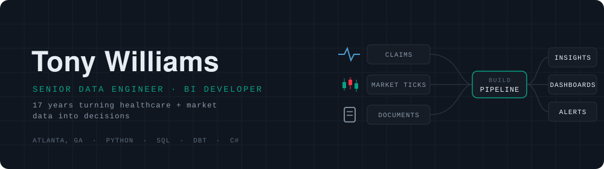
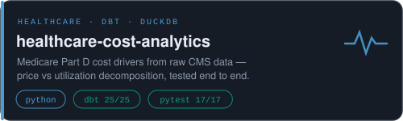
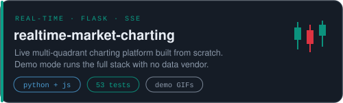
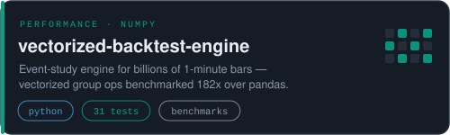
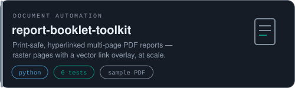
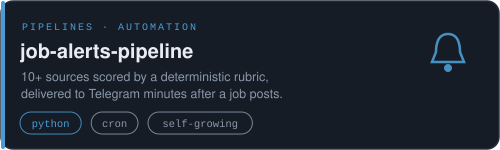
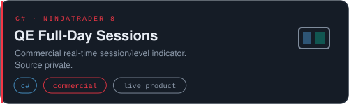
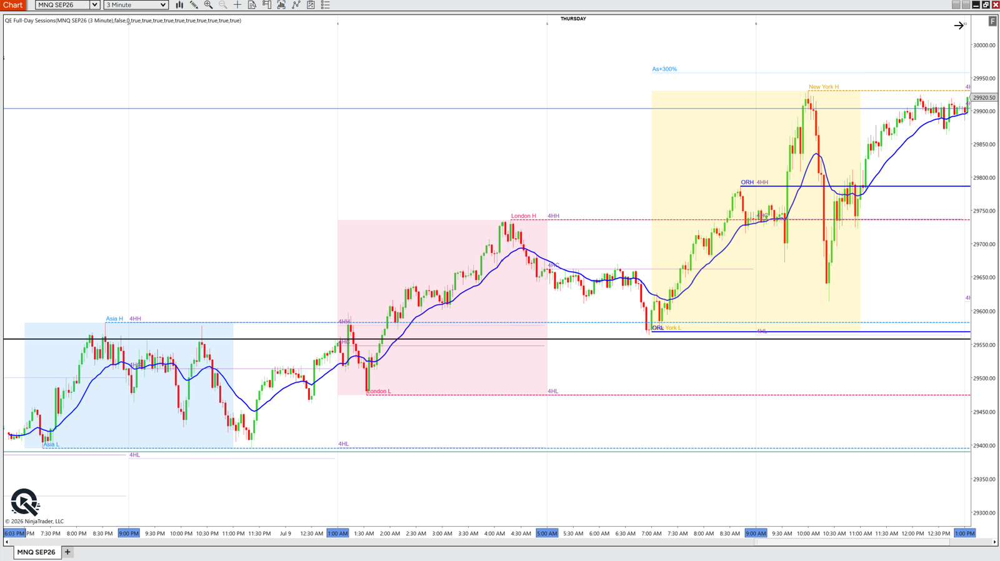
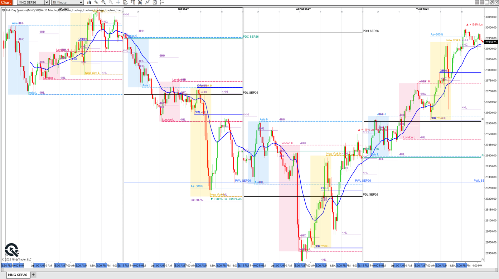

  

<table>
<tr>
<td></td>
<td></td>
</tr>
<tr>
<td></td>
<td></td>
</tr>
<tr>
<td></td>
<td></td>
</tr>
</table>

  

<b>QE Full-Day Sessions</b> — commercial C# indicator on NinjaTrader 8. Session boxes, opening range, and prior-period levels drawn live as price prints. Source private; happy to walk through the architecture in an interview.

  

  

**17 years** in healthcare-payer finance & analytics — Anthem, Aon, Willis Towers Watson, BCBS-NC, Wellnecity — building the pipelines, reconciliation systems, and self-serve reporting that take manual work off analyst teams. Named AI SME for enterprise Claude/agentic adoption.

Python (pandas · NumPy) &nbsp;·&nbsp; SQL (Snowflake · Teradata · BigQuery · Postgres) &nbsp;·&nbsp; dbt &nbsp;·&nbsp; Tableau &nbsp;·&nbsp; AWS &nbsp;·&nbsp; Claude & LLM tooling

📫 [LinkedIn](https://www.linkedin.com/in/tonydwilliams1)

